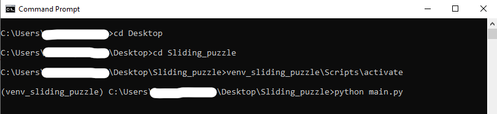
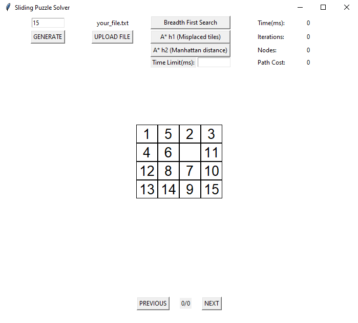
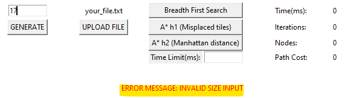
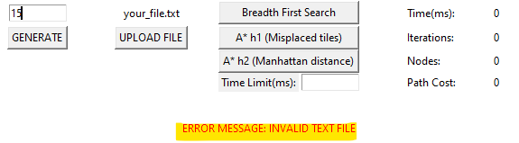
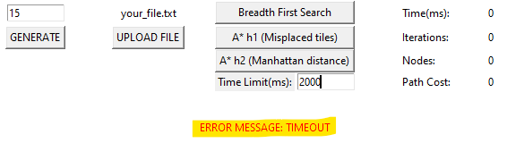

# **Table of Contents**

- [**Table of Contents**](#table-of-contents)
- [**1-Introduction**](#1-introduction)
  - [**1.1 What is about**](#11-what-is-about)
  - [**1.2 Algorithms**](#12-algorithms)
    - [**- Breadth first search / Uniform Cost Search**](#--breadth-first-search--uniform-cost-search)
    - [**- A\* with two different heuristic functions h1 and h2**](#--a-with-two-different-heuristic-functions-h1-and-h2)
  - [**1.3 Execution environment**](#13-execution-environment)
  - [**1.4 Python Libraries**](#14-python-libraries)
- [**2-File Structure**](#2-file-structure)
- [**3-User Guide**](#3-user-guide)
  - [**3.1 How to run the program**](#31-how-to-run-the-program)
  - [**3.2 How to use the GUI**](#32-how-to-use-the-gui)
    - [**3.2.1 Generate**](#321-generate)
    - [**3.2.2 Upload**](#322-upload)
    - [**3.2.3 Algorithms**](#323-algorithms)
    - [**3.2.4 Timelimit**](#324-timelimit)
    - [**3.2.5 Output results**](#325-output-results)
    - [**3.2.6 Next, previous**](#326-next-previous)
- [**4- Code Structure**](#4--code-structure)
  - [**Puzzle Class**](#puzzle-class)
  - [**BFS Class**](#bfs-class)
  - [**A_Star Class**](#a_star-class)
  - [**GUI Class**](#gui-class)
- [**5- Comparison of performance**](#5--comparison-of-performance)
  - [**Puzzle of 3 Tiles**](#puzzle-of-3-tiles)
  - [**Puzzle of 8 Tiles**](#puzzle-of-8-tiles)
  - [**Puzzle of 15 Tiles**](#puzzle-of-15-tiles)
  - [**Puzzle of 24 Tiles**](#puzzle-of-24-tiles)
  - [**Puzzle of 35 Tiles**](#puzzle-of-35-tiles)
  - [**Puzzle of 48 Tiles**](#puzzle-of-48-tiles)
  - [**Puzzle of 63 Tiles**](#puzzle-of-63-tiles)
- [**6- Conclusion**](#6--conclusion)
- [**7- References**](#7--references)

# **1-Introduction**

## **1.1 What is about**

I did this project to learn advanced search algorithms by implementing them and comparing ther performance. For this purpose a graphical user interface has been developed to make the use of the program more intuitive and the programming language Python has been used since it is object oriented and also intuitive.

## **1.2 Algorithms**

The chosen algorithms are two:
<br>
<br>

### **- Breadth first search / Uniform Cost Search**

This two algorithms in the sliding puzzle are equivalent because at each step where new nodes are created, they have the same cost so they will all be sequentially traversed to their end by the order of their creation as the BFS algorithm does.
<br>
<br>

### **- A\* with two different heuristic functions h1 and h2**

The cost of each puzzle is calculated as follows:

**_puzzle cost = how many steps to create the puzzle + heuristic_func(puzzle)_**

Two different heuristic functions has been used:

**h1 (misplaced tiles):** it checks if each tile is in its place as in the final state puzzle, and returns the number of tiles that are moved from their final state. For example, in this puzzle of 3 tiles:
\
0 2 \
1 3

Goal state is
\
0 1\
2 3

The h1 function will return 2 because the values "2" and "1" aren't in their final position.

**h2 (manhattan distance):** it calculates the distance between the current position of the tile and its goal position, and returns the sum of all distances. For example, in this puzzle of 3 tiles:
\
3 1 2 \
6 4 5 \
7 8 0

Goal state is
\
0 1 2 \
3 4 5 \
6 7 8

Distance of a tile is calculate as follow:

_distance = abs(tile_pos_i - goal_pos_i) + abs(tile_pos_j - goal_pos_j)_

_tile_pos_i_ : means the index i of the tile position \
_tile_pos_j_ : means the index j of the tile position \
_goal_pos_i_ : means the index i of the tile in goal position \
_goal_pos_j_ : means the index j of the tile in goal position

distance of tile "0" = abs(2 - 0) + abs(2 - 0) = 4 \
distance of tile "1" = abs(0 - 0) + abs(1 - 1) = 0 \
distance of tile "2" = abs(0 - 0) + abs(2 - 2) = 0 \
distance of tile "3" = abs(0 - 1) + abs(0 - 0) = 1 \
distance of tile "4" = abs(1 - 1) + abs(1 - 1) = 0 \
distance of tile "5" = abs(1 - 1) + abs(2 - 2) = 0 \
distance of tile "6" = abs(1 - 2) + abs(0 - 0) = 1 \
distance of tile "7" = abs(2 - 2) + abs(0 - 1) = 1 \
distance of tile "8" = abs(2 - 2) + abs(1 - 2) = 1

manhattan distance = 4 + 0 + 0 + 1 + 0 + 0 + 1 + 1 + 1 = 8

## **1.3 Execution environment**

**_OS :_** Windows 10 \
**_Python :_** 3.10 \
**_Processor:_** Core i5-7300 2.60Ghz (4 CPUs) \
**_RAM:_** 8 Go

## **1.4 Python Libraries**

_Internal libraries:_

- **_math_:** for using the **sqrt** and the infinite value called **inf**
- **_queue_:** for using the **normal Queue** in the BFS algo and the **priority Queue** in the A\* algo
- **_time_:** to get time in milliseconds to calculate the **elapsed time** for solving the puzzle problem and also to respect the **timelimit**
- **_copy_:** used to deeply copy a 2D list
- **_random_:** for using random.range() and random.choice()

_External libraries:_

- **_tkinter_:** used for the graphical user interface since it is well known and well documented

# **2-File Structure**

    .
    ├── img                     # folder containing images for README file
    ├── puzzles                 # folder containing folders of puzzle samples
    |   |                       # of different sizes
    |   ├── puzzles_8           # folder containing puzzles samples of 8 tiles
    |   └── puzzles_15          # folder containing puzzles samples of 15 tiles
    ├── venv_sliding_puzzle     # the python virtual environment that contains
    |                           # all project dependencies
    ├── a_star.py               # python program that defines the A_Star class
    ├── bfs.py                  # python program that defines the BFS class
    ├── comparison.py           # python program to compare the performance
    |                           # of BFS, and A* with h1, h2
    ├── gui.py                  # python program that defines the GUI class
    ├── main.py                 # python program that runs the whole project
    ├── puzzle.py               # python program that defines the Puzzle class
    └── README.md               # README file

# **3-User Guide**

## **3.1 How to run the program**

**Activate the virtual environment of python**

The virtual environment in the folder "venv_sliding_puzzle" contains all the libraries needed to run the program. You will need to activate it in the terminal window that you will use to launch the main.py program.

Inside the project directory tap the following command:

    Project_Directory> venv_sliding_puzzle\Scripts\activate

**Run the GUI**

In the same terminal, tap the following command:

    python main.py

The result should be like in the bellow image:



## **3.2 How to use the GUI**

The below image represent the developped graphical user interface:



### **3.2.1 Generate**

The input represents the number of tiles in the puzzle. The (input number + 1) must represent a squared number since the puzzle is square. Example 1: 15 + 1 = 16 = 4². Example 2 : 3 + 1 = 2².

In case the number entered isn't valid, then the following message is displayed:



### **3.2.2 Upload**

The uploaded file must respect the following format:

0 1 2 \
3 4 5 \
6 7 8

A blank space between two tiles and the newline character in the end of each row. The number 0 represent the empty tile.

In case no file is selected when it's asked to in the explorer window, the following error message is displayed:



### **3.2.3 Algorithms**

You can choose one algorithm at a time to solve the current displayed puzzle, and wait for the results.

### **3.2.4 Timelimit**

You can enter a value in milliseconds which the choosen algorithm must not exceed to solve the puzzle. And if the solving operation couldn't finish before the entered value, the following error is displayed.



### **3.2.5 Output results**

**_Time:_** Elapsed time for resolution\
**_Iterations:_** Total number of puzzles traversed\
**_Nodes:_** Total number of nodes created\
**_Path Cost:_** Number of moves to reach the goal state

### **3.2.6 Next, previous**

When the sliding puzzle is solved using one of the three algorithms, you can used the next and previous button to iterate through every step towards the goal state puzzle.


# **4- Code Structure**

The code is divided into 4 classes, each in a separate file.

## **Puzzle Class**

The instantiation of this class represents the state of the puzzle, because it contains the matrix, the parent that created the puzzle, the number of moves to create the puzzle, and the position of the empty tile.

This class contains these important methods:

**_is_goal_**: Verify if the matrix of the puzzle is equivalent to the gooal matrix which is represented as follows:

For puzzle of 8 tiles:\
0 1 2 \
3 4 5 \
6 7 8

**_get_all_possible_actions_**: This method generates and return all the possible states that can be generated from the puzzle. And this by applying 4 actions that are implemented in those 4 methods:

**_move_right_action:_**

```
4 1 6         4 1 6
3 0 5   ->    0 3 5
2 7 8         2 7 8
```

**_move_left_action:_**

```
4 1 6         4 1 6
3 0 5   ->    3 5 0
2 7 8         2 7 8
```

**_move_up_action:_**

```
4 1 6         4 1 6
3 0 5   ->    3 7 5
2 7 8         2 0 8
```

**_move_down_action:_**

```
4 1 6         4 0 6
3 0 5   ->    3 1 5
2 7 8         2 7 8
```

## **BFS Class**

This class is instantiated like this: bfs = BFS(matrix). Its takes only the matrix and it creates in it way all the puzzle states.

It solves the puzzle matrix in the given timelimit by calling this method: bfs.solve(timelimit).

After the solve, we can call the following methods to get the results:

- getIterations
- getTotalNodes
- getPath
- getPathCost
- getElapsedTime

## **A_Star Class**

This class like the BFS class takes as parameter the matrix of the puzzle like this: a_star = A_Star(matrix).

To solve the puzzle, we have two choices. Either using the heuristic function h1 that calculate the misplaced tiles using this method call: a_star.solve_with_h1(timelimit). Or the heuristic function h2 that calculate the Manhattan distance using this method call: a_star.solve_with_h2(timelimit).

After the solve, we can call the following methods to get the results:

- getIterations
- getTotalNodes
- getPath
- getPathCost
- getElapsedTime

## **GUI Class**

This class creates and display all GUI components and allows to randomly generate and upload puzzles from text files. It creates buttons to solve the puzzle using the 3 differents functions mentionned in the Algorithms section and after finishing, it displays the results.

# **5- Comparison of performance**

To compare the 3 functions, we had to generate for each size, several random puzzles and group the average performances of each function in the following tables. The python code for comparison can be found in the file "comparison.py".

**_Note:_** The number of samples (generated puzzles) taken is 5. The timelimit is 1 minute.

## **Puzzle of 3 Tiles**

|            | BFS | A\* h1 | A\* h2 |
| ---------- | --- | ------ | ------ |
| Time (ms)  | 0.0 | 0.0    | 0.0    |
| Iterations | 8.4 | 5.4    | 5.0    |
| Nodes      | 9.2 | 6.4    | 6.0    |
| Path Cost  | 4.0 | 4.0    | 4.0    |

## **Puzzle of 8 Tiles**

|            | BFS    | A\* h1 | A\* h2 |
| ---------- | ------ | ------ | ------ |
| Time (ms)  | 105.6  | 3.6    | 3.0    |
| Iterations | 2484.4 | 96.4   | 64.0   |
| Nodes      | 3827.2 | 160.6  | 107.0  |
| Path Cost  | 11.4   | 11.4   | 11.4   |

## **Puzzle of 15 Tiles**

|            | BFS      | A\* h1 | A\* h2 |
| ---------- | -------- | ------ | ------ |
| Time (ms)  | 10731.4  | 9.4    | 4.2    |
| Iterations | 144218.2 | 127.4  | 40.8   |
| Nodes      | 281040.2 | 262.6  | 84.4   |
| Path Cost  | 11.6     | 11.6   | 11.6   |

## **Puzzle of 24 Tiles**

|            | BFS     | A\* h1 | A\* h2 |
| ---------- | ------- | ------ | ------ |
| Time (ms)  | Timeout | 60.4   | 60.0   |
| Iterations | Timeout | 173.4  | 140.4  |
| Nodes      | Timeout | 390    | 279.6  |
| Path Cost  | Timeout | 16.6   | 16.6   |

## **Puzzle of 35 Tiles**

|            | BFS     | A\* h1 | A\* h2 |
| ---------- | ------- | ------ | ------ |
| Time (ms)  | Timeout | 117.0  | 44.8   |
| Iterations | Timeout | 770.6  | 122.8  |
| Nodes      | Timeout | 1775.2 | 261.2  |
| Path Cost  | Timeout | 13.0   | 13.0   |

## **Puzzle of 48 Tiles**

|            | BFS     | A\* h1 | A\* h2 |
| ---------- | ------- | ------ | ------ |
| Time (ms)  | Timeout | 50.6   | 26.0   |
| Iterations | Timeout | 279.8  | 45.4   |
| Nodes      | Timeout | 693.8  | 101.2  |
| Path Cost  | Timeout | 11.0   | 11.0   |

## **Puzzle of 63 Tiles**

|            | BFS     | A\* h1 | A\* h2 |
| ---------- | ------- | ------ | ------ |
| Time (ms)  | Timeout | 92.2   | 85.4   |
| Iterations | Timeout | 344.8  | 109.2  |
| Nodes      | Timeout | 918.8  | 247.2  |
| Path Cost  | Timeout | 12.6   | 12.6   |

# **6- Conclusion**

The A* algorithm is outperforming Uniform Cost Search at all levels in all aspects (time, nodes expansion, iterations). But specifically A* with Manhattan distance remains the fastest for all sizes.

Because the heuristic function Misplaced Tiles does misevaluate some puzzles as the following two examples:

Let's take this first example:

5 1 2 \
3 4 0 \
6 7 8

The function h1 returns cost 2 because there are only two tiles that are misplaced. However, it takes a lot of moves to solve the puzzle.

Let's take this second example which gives a high cost (cost = 4) even though there are very few moves to do to solve the puzzle:

1 4 2 \
3 5 0 \
6 7 8

It can be solved by 3 moves (left, up, left).

# **7- References**

Inspired by the implementation: [https://www.youtube.com/watch?v=6edibwHBDFk](https://www.youtube.com/watch?v=6edibwHBDFk)

Inspired by the source code: [https://github.com/rjoonas/AI-assignment-1](https://github.com/rjoonas/AI-assignment-1)

Inspired by the graphical user interface: [https://github.com/AndreyFedchuk/8-puzzle](https://github.com/AndreyFedchuk/8-puzzle)
